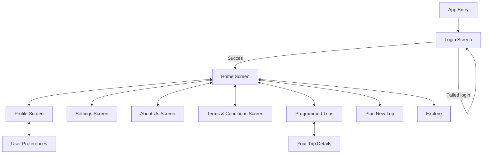
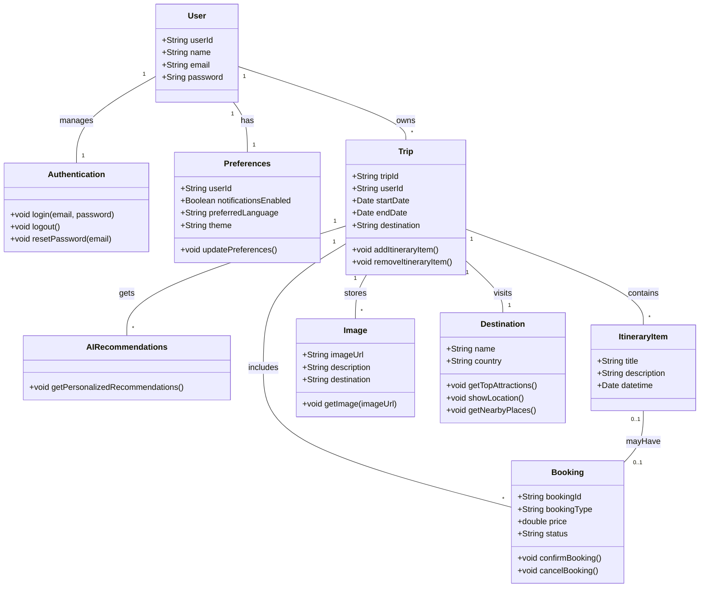

```mermaid
graph TD
    A[App Entry] --> B[Login Screen]
    B --> |Succes| C[Home Screen]
    B --> |Failed login| B
    C <--> D[Profile Screen]
    C <--> E[Settings Screen]
    C <--> F[About Us Screen]
    C <--> G[Terms & Conditions Screen]
    C <--> H[Programmed Trips]
    C <--> I[Plan New Trip]
    C <--> J[Explore]
    D <--> K[User Preferences]
    H <--> L[Your Trip Details]

```

```mermaid
classDiagram
    class User {
        +String userId
        +String name
        +String email
        +Sring password
    }

    class Authentication {
        +void login(email, password)
        +void logout()
        +void resetPassword(email)
    }

    class Preferences {
        +String userId
        +Boolean notificationsEnabled
        +String preferredLanguage
        +String theme 
        +void updatePreferences()
    }

    class AIRecommendations {
        +void getPersonalizedRecommendations()
    }

    class Trip {
        +String tripId
        +String userId
        +Date startDate
        +Date endDate
        +String destination
        +void addItineraryItem()
        +void removeItineraryItem()
    }
    class ItineraryItem {
        +String title
        +String description
        +Date datetime
    }

    class Image {
        +String imageUrl
        +String description
        +String destination
        +void getImage(imageUrl)
    }

    class Booking {
        +String bookingId
        +String bookingType
        +double price
        +String status
        +void confirmBooking()
        +void cancelBooking()
    }

    class Destination {
        +String name
        +String country
        +void getTopAttractions()
        +void showLocation()
        +void getNearbyPlaces()
    }


    User "1" -- "1" Preferences : has
    User "1" -- "1" Authentication : manages
    User "1" -- "*" Trip : owns
    Trip "1" -- "*" ItineraryItem : contains
    Trip "1" -- "*" Image : stores
    Trip "1" -- "*" AIRecommendations : gets
    Trip "1" -- "*" Booking : includes
    Trip "1" -- "1" Destination : visits
    ItineraryItem "0..1" -- "0..1" Booking : mayHave
```

